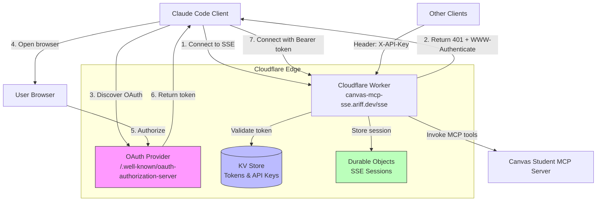

# Authentication Setup Guide

## Overview

This MCP server supports two authentication methods for maximum flexibility:

1. **OAuth 2.1** (Recommended) - Standard OAuth flow with PKCE for secure, user-friendly authentication
2. **API Keys** - Direct header-based authentication for simple integrations

## Architecture



## Method 1: OAuth 2.1 (Recommended)

### Setup

1. **Add MCP Server to Claude Code**

```bash
claude mcp add --transport sse canvas https://canvas-mcp-sse.ariff.dev/sse
```

2. **Authenticate via /mcp command**

In Claude Code, run:
```
/mcp
```

Select "Canvas" and choose "Authenticate". This will:
- Open your browser
- Redirect to OAuth authorization page
- Complete PKCE flow
- Store token securely
- Auto-refresh when expired

### OAuth Endpoints

The server implements the full OAuth 2.1 specification:

- **Discovery**: `/.well-known/oauth-authorization-server`
- **Authorization**: `/oauth/authorize`
- **Token**: `/oauth/token`

### OAuth Flow

1. Client requests `/.well-known/oauth-authorization-server`
2. Server returns metadata with authorization/token endpoints
3. Client initiates authorization with PKCE challenge
4. User authenticates via browser
5. Server returns authorization code
6. Client exchanges code for access token (with PKCE verifier)
7. Client uses Bearer token for MCP requests

## Method 2: API Keys

### For End Users

If you prefer API keys over OAuth:

```bash
claude mcp add --transport sse --header "X-API-Key: YOUR_API_KEY" canvas https://canvas-mcp-sse.ariff.dev/sse
```

Or configure in MCP settings JSON:

```json
{
  "mcpServers": {
    "canvas": {
      "transport": "sse",
      "url": "https://canvas-mcp-sse.ariff.dev/sse",
      "headers": {
        "X-API-Key": "your-api-key-here"
      }
    }
  }
}
```

### Generating API Keys

API keys can be generated by server administrators:

```bash
# Using wrangler CLI
wrangler kv:key put --binding API_KEYS_KV "apikey:mcp_key_abc123" \
  '{"userId":"user123","permissions":["read","write"],"createdAt":"2025-10-03T00:00:00Z"}'
```

Or via the admin API endpoint (requires admin authentication).

## Deployment

### Prerequisites

1. Cloudflare account with Workers enabled
2. Wrangler CLI installed
3. Custom domain configured (ariff.dev)

### Steps

1. **Create KV Namespaces**

```bash
cd packages/remote-mcp-server-authless

# Create OAuth KV namespace
wrangler kv:namespace create "OAUTH_KV"

# Create API Keys KV namespace
wrangler kv:namespace create "API_KEYS_KV"
```

2. **Update wrangler.jsonc**

Replace the placeholder IDs in `wrangler.jsonc` with the IDs from step 1:

```jsonc
{
  "kv_namespaces": [
    {
      "binding": "OAUTH_KV",
      "id": "your-oauth-kv-id"
    },
    {
      "binding": "API_KEYS_KV",
      "id": "your-api-keys-kv-id"
    }
  ]
}
```

3. **Set Secrets**

```bash
# OAuth client secret (optional, for confidential clients)
wrangler secret put OAUTH_CLIENT_SECRET

# Admin API key (for key generation)
wrangler secret put ADMIN_API_KEY
```

4. **Deploy**

```bash
npm run deploy
```

### Verify Deployment

Test the OAuth discovery endpoint:

```bash
curl https://canvas-mcp-sse.ariff.dev/.well-known/oauth-authorization-server
```

Should return:

```json
{
  "issuer": "https://canvas-mcp-sse.ariff.dev",
  "authorization_endpoint": "https://canvas-mcp-sse.ariff.dev/oauth/authorize",
  "token_endpoint": "https://canvas-mcp-sse.ariff.dev/oauth/token",
  "grant_types_supported": ["authorization_code", "refresh_token"],
  "response_types_supported": ["code"],
  "code_challenge_methods_supported": ["S256"],
  "token_endpoint_auth_methods_supported": ["client_secret_basic", "client_secret_post", "none"]
}
```

## Security Considerations

### OAuth 2.1 Features

- **PKCE Mandatory**: All authorization flows require PKCE (Proof Key for Code Exchange)
- **Short-lived Tokens**: Access tokens expire after 1 hour
- **Refresh Tokens**: Support for long-lived refresh tokens (30 days)
- **HTTPS Only**: All endpoints require HTTPS
- **State Parameter**: CSRF protection via state parameter

### API Key Best Practices

- Store keys securely (never commit to git)
- Rotate keys regularly (30-day expiration)
- Use environment variables or secure vaults
- Monitor key usage via analytics

### Token Storage

- OAuth tokens: Stored in Cloudflare KV with automatic TTL
- API keys: Encrypted and scoped per user
- No plaintext credentials stored

## Troubleshooting

### 401 Unauthorized

- **OAuth**: Token may be expired. Re-authenticate via `/mcp` command.
- **API Key**: Check that `X-API-Key` header is present and valid.

### OAuth Discovery Fails

Verify the well-known endpoint is accessible:
```bash
curl -v https://canvas-mcp-sse.ariff.dev/.well-known/oauth-authorization-server
```

### PKCE Verification Failed

Ensure your OAuth client properly implements PKCE with SHA-256.

## Support

For issues or questions:
- GitHub Issues: https://github.com/a-ariff/canvas-student-mcp-server/issues
- MCP Documentation: https://modelcontextprotocol.io
