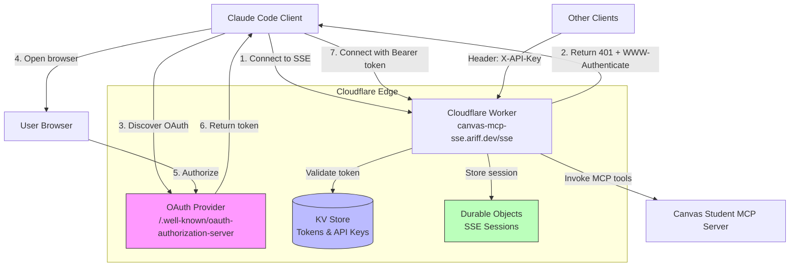

# Canvas MCP SSE Server

A secure **Model Context Protocol (MCP) server** deployed on Cloudflare Workers with OAuth 2.1 and API Key authentication.

🌐 **Live Server**: <https://canvas-mcp-sse.ariff.dev/sse>

[](./SECURITY-FIXES.md)
[](./src/__tests__)
[](./SECURITY-FIXES.md#attack-scenarios-prevented)

## Features

- ✅ **OAuth 2.1 Authentication** with PKCE support (RFC 7636)
- ✅ **API Key Authentication** for simple integrations
- ✅ **Server-Sent Events (SSE)** transport for real-time communication
- ✅ **Cloudflare Workers** for global edge deployment
- ✅ **Durable Objects** for stateful MCP sessions
- ✅ **KV Storage** for secure token and API key management

## Security

This implementation includes comprehensive security validations:

- 🔒 **Client ID Whitelist** - Only registered clients allowed
- 🔒 **Redirect URI Validation** - Exact match against per-client whitelist
- 🔒 **Authorization Code Binding** - Prevents interception attacks
- 🔒 **Client Authentication** - Validates confidential clients
- 🔒 **PKCE Mandatory** - SHA-256 code challenge required

**Attack Prevention:** All common OAuth attack vectors are tested and blocked. See [SECURITY-FIXES.md](./SECURITY-FIXES.md) for details.

## Quick Start

### For Claude Code Users

```bash
# Add the MCP server
claude mcp add --transport sse canvas https://canvas-mcp-sse.ariff.dev/sse

# Authenticate via OAuth (opens browser)
# In Claude Code, run:
/mcp
# Select "canvas" and authenticate
```

### For Other MCP Clients

With API key authentication:

```bash
# Add with custom header
claude mcp add --transport sse --header "X-API-Key: YOUR_KEY" canvas https://canvas-mcp-sse.ariff.dev/sse
```

See [AUTHENTICATION.md](./AUTHENTICATION.md) for detailed setup instructions.

## Architecture



*Paste this diagram into [https://mermaid.live](https://mermaid.live) to visualize*

## Development

### Prerequisites

- Node.js 18+
- Wrangler CLI (`npm install -g wrangler`)
- Cloudflare account

### Setup

```bash
# Install dependencies
npm install

# Create KV namespaces
wrangler kv:namespace create "OAUTH_KV"
wrangler kv:namespace create "API_KEYS_KV"

# Update wrangler.jsonc with the KV namespace IDs

# Run locally
npm run dev

# Deploy to Cloudflare
npm run deploy
```

### Testing

```bash
# Type check
npm run type-check

# Run tests (includes security attack scenarios)
npm test
# ✓ 14 tests passing
# ✓ 5 security attack scenarios validated

# Test OAuth discovery endpoint
curl https://canvas-mcp-sse.ariff.dev/.well-known/oauth-authorization-server

# Test authenticated SSE connection
curl -H "Authorization: Bearer your-token" \
  https://canvas-mcp-sse.ariff.dev/sse
```

**Security Test Coverage:**

- ✅ Unknown client ID rejection
- ✅ Unauthorized redirect URI blocking
- ✅ Authorization code interception prevention
- ✅ Client secret validation
- ✅ Refresh token theft prevention

See [oauth-security.test.ts](./src/__tests__/oauth-security.test.ts) for all test scenarios.

## Customization

Add custom MCP tools in `src/index.ts`:

```typescript
async init() {
  this.server.tool("my-tool", { param: z.string() }, async ({ param }) => ({
    content: [{ type: "text", text: `Result: ${param}` }],
  }));
}
```

## Authentication Methods

### OAuth 2.1 (Recommended)

- Browser-based authentication
- Automatic token refresh
- Secure PKCE flow (RFC 7636)
- Best for end users

### API Keys

- Simple header-based auth
- `X-API-Key: your-key` header
- Best for server-to-server integrations

Complete authentication documentation: [AUTHENTICATION.md](./AUTHENTICATION.md)

## Deployment

This server is configured for deployment at `canvas-mcp-sse.ariff.dev` on Cloudflare Workers.

```bash
# Deploy to production
npm run deploy

# Deploy to staging
wrangler deploy --env development
```

## Documentation

- [Authentication Guide](./AUTHENTICATION.md) - Complete auth setup
- [Security Implementation](./SECURITY-FIXES.md) - OAuth security fixes & attack prevention
- [Security Tests](./src/__tests__/oauth-security.test.ts) - Test suite with attack scenarios
- [MCP Specification](https://modelcontextprotocol.io) - MCP protocol docs
- [Cloudflare Workers](https://developers.cloudflare.com/workers/) - Platform docs
- [OAuth 2.1](https://datatracker.ietf.org/doc/html/draft-ietf-oauth-v2-1-11) - OAuth spec

## License

MIT
